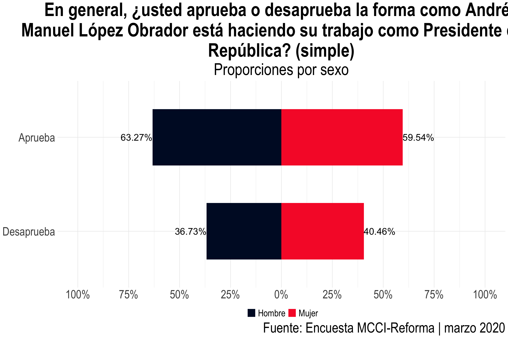

Los Mexicanos Frente a la Corrupción y la Impunidad
================
MCCI-UIA

<style type="text/css">
pre {
  max-height: 500px;
  overflow-y: auto;
}

pre[class] {
  max-height: 250px;
}
</style>

## Introducción

Los paquetes que se utilizaron para este análisis son:

``` r
require(foreign)
require(mxmaps)
require(haven)
require(srvyr)
require(dplyr)
require(ggpubr)
require(gtable)
require(grid)
require(gridExtra)
require(tidyverse)
```

La programación con base en funciones es útil para sistematizar
procesos. Otra ventaja es que permite identificar los errores cometidos
de forma sencilla. Previo a la recodificación y a la estimación de
resultados, se programaron dos funciones muy sencillas cuyo objetivo es
generar un identificador sistematizado de, por un lado, aquellas
variables que son “factores de expansión” `rename_fac()` y, por otro
lado, las variables cuyos resultados se desean estimar `rename_names()`.

``` r
# Funciones para renombrar ----
rename_fac <- function(x){
  paste0("fac_", x)
}

recode_names <- function(x){
  x = 
    case_when(
      x == "p1" ~ v_names[1],
      x == "p3" ~ v_names[2],
      x == "p4" ~ v_names[3],
      x == "p5" ~ v_names[4],
      x == "p6a" ~ v_names[5],
      x == "p6b" ~ v_names[6],
      x == "p6c" ~ v_names[7],
      x == "p6d" ~ v_names[8],
      x == "p7" ~ v_names[9],
      x == "p8a" ~ v_names[10],
      x == "p8b" ~ v_names[11],
      x == "p8c" ~ v_names[12],
      x == "p8d" ~ v_names[13],
      x == "p8e" ~ v_names[14],
      x == "p8f" ~ v_names[15],
      x == "p8g" ~ v_names[16],
      x == "p8h" ~ v_names[17],
      x == "p8i" ~ v_names[18],
      x == "p8j" ~ v_names[19],
      x == "p8k" ~ v_names[20],
      x == "p8l" ~ v_names[21],
      x == "p8m" ~ v_names[22],
      x == "p8n" ~ v_names[23],
      x == "p8o" ~ v_names[24],
      x == "p8p" ~ v_names[25],
      x == "p8q" ~ v_names[26],
      x == "p8r" ~ v_names[27],
      x == "p8s" ~ v_names[28],
      x == "p8t" ~ v_names[29],
      x == "p9a" ~ v_names[30],
      x == "p9b" ~ v_names[31],
      x == "p9c" ~ v_names[32],
      x == "p10" ~ v_names[33],
      x == "p11" ~ v_names[34],
      x == "p12" ~ v_names[35],
      x == "p13" ~ v_names[36],
      x == "p14" ~ v_names[37],
      x == "p15" ~ v_names[38],
      x == "p16" ~ v_names[39],
      x == "p17" ~ v_names[40],
      x == "p18" ~ v_names[41],
      x == "p19" ~ v_names[42],
      x == "p20" ~ v_names[43],
      x == "p21" ~ v_names[44],
      x == "p22" ~ v_names[45],
      x == "p23" ~ v_names[46],
      x == "p24" ~ v_names[47],
      x == "p25" ~ v_names[48],
      x == "p26" ~ v_names[49],
      x == "p27" ~ v_names[50],
      x == "p28" ~ v_names[51],
      x == "p29a" ~ v_names[52],
      x == "p29b" ~ v_names[53],
      x == "p29c" ~ v_names[54],
      x == "p29d" ~ v_names[55],
      x == "p29e" ~ v_names[56],
      x == "p29f" ~ v_names[57],
      x == "p29g" ~ v_names[58],
      x == "p30" ~ v_names[59],
      x == "p31" ~ v_names[60],
      x == "p32a" ~ v_names[61],
      x == "p32b" ~ v_names[62],
      x == "p32c" ~ v_names[63],
      x == "p33a" ~ v_names[64],
      x == "p33b" ~ v_names[65],
      x == "p33c" ~ v_names[66],
      x == "p33d" ~ v_names[67],
      x == "p33e" ~ v_names[68],
      x == "p34a" ~ v_names[69],
      x == "p34b" ~ v_names[70],
      x == "p34c" ~ v_names[71],
      x == "p34d" ~ v_names[72],
      x == "p34e" ~ v_names[73],
      x == "p34f" ~ v_names[74],
      x == "p34g" ~ v_names[75],
      x == "p35" ~ v_names[76],
      x == "p36" ~ v_names[77],
      x == "p37" ~ v_names[78],
      x == "p38" ~ v_names[79],
      x == "p39a" ~ v_names[80],
      x == "p39b" ~ v_names[81],
      x == "p39c" ~ v_names[82],
      x == "p39d" ~ v_names[83],
      x == "p39e" ~ v_names[84],
      x == "p39f" ~ v_names[85],
      x == "p39g" ~ v_names[86],
      x == "p40a" ~ v_names[87],
      x == "p40b" ~ v_names[88],
      x == "p40c" ~ v_names[89],
      x == "p40d" ~ v_names[90],
      x == "p40e" ~ v_names[91],
      x == "p40f" ~ v_names[92],
      x == "p40g" ~ v_names[93],
      x == "p40h" ~ v_names[94],
      x == "p41" ~ v_names[95],
      x == "p42" ~ v_names[96],
      x == "p43" ~ v_names[97],
      x == "boleta" ~ v_names[98],
      x == "p1r" ~ v_names[99],
      x == "p3r" ~ v_names[100]
    )
}
```

Con el objetivo de facilitar y automatizar lo más posible el proceso de
análisis, se estableció una paleta de colores institucionales…

``` r
# Paletas de colores ----
mcci_discrete <- c(
  '000c2d', # (azul oscuro)
  'f72732', # (rojo mcci)
  'fff72d', # (crema)
  'ffffff', # (blanco)
  '333333' # (texto)
)
```

…se trabajó con directorios, cuya lógica es crear dos objetos de tipo
caracter con la ruta de la carpeta en donde se guardaron los datos a
analizar (`input`), y la carpeta en la que se guardarán los resultados
deseados (`output`).

``` r
# Directorios ----
inp <- "~/Github/MCCI_LMFCI2020/01_datos/"
out <- "~/Github/MCCI_LMFCI2020/03_gráficas/"
```

Otra ventaja de usar R es que se pueden crear codebooks de forma muy
rápida y sencilla a partir de los atributos de una base de datos
`.sav`.

``` r
# Datos ----
d <- read.spss(paste0(inp,"N202003_MCCI.sav"),to.data.frame = T) %>% 
  as.tibble()
colnames(d) <- tolower(colnames(d))
codebook_2020  <- tibble(etiqueta = colnames(d)) %>%
  mutate(pregunta = attr(d, "variable.labels"))

knitr::kable(
  codebook_2020 %>% 
    filter(str_starts(etiqueta, "p"))%>% filter(!etiqueta=="punto") %>% 
    head(10)
) %>%
  kableExtra::kable_styling(bootstrap_options = "striped", full_width = F)
```

| etiqueta | pregunta                                                                                                                                        |
| :------- | :---------------------------------------------------------------------------------------------------------------------------------------------- |
| p1       | 1\. En su opinión, ¿cuál es el principal problema que hay en el País hoy en día?                                                                |
| p3       | 3\. En general, ¿usted aprueba o desaprueba la forma como Andrés Manuel López Obrador está haciendo su trabajo como Presidente de la República? |
| p4       | 4\. Si hoy hubiera elecciones para decidir si Andrés Manuel López Obrador debe permanecer en el cargo o debe renunciar, ¿usted cómo votaría?    |
| p5       | 5\. ¿Cuál cree usted que es la principal causa de la corrupción en México?                                                                      |
| p6a      | 6A. ¿Usted diría que se justifica Dar una mordida para evitar una detención injusta o no se justifica?                                          |
| p6b      | 6B. ¿Usted diría que se justifica Dar una propina para acelerar un trámite o no se justifica?                                                   |
| p6c      | 6C. ¿Usted diría que se justifica Asistir a un evento político para recibir algún programa social o no se justifica?                            |
| p6d      | 6D. ¿Usted diría que se justifica Usar un puesto público para beneficiar a un familiar, a un amigo o a un conocido o no se justifica?           |
| p7       | 7\. ¿En dónde cree usted que se dan más actos de corrupción?                                                                                    |
| p8a      | 8a. En general, ¿cuánta corrupción cree usted que hay en Escuelas públicas?                                                                     |

Finalmente, se realizó una recodificación y se crearon vectores de tipo
carácter para facilitar la automatización del análisis. El objetivo
principal es crear un código eficiente con los menores cambios manuales
posibles.

``` r
# Recodificación ----
v_names <- codebook_2020$pregunta[c(16:113,139,140)]
v_names <- tolower(v_names)
v_names <- trimws(v_names)
v_names <- str_replace_all(v_names, "[[:punct:]]", "")
v_names <- str_replace_all(v_names, " ", "_")
v_names <- paste0("v_",v_names)
v_names[97] <- "v_43_sumando_todo_lo_que_ganan_los_integrantes_de_este_hogar_cuánto_ganan_en_total_al_mes"
v_names[98] <- "v_44_si_hoy_hubiera_elecciones_para_diputados_federales_por_cuál_partido_votaría_usted"
v_names[99] <- paste0(v_names[99],"_simple")
v_names[100] <- paste0(v_names[2],"_simple")

data_2020 <- d %>% 
  rename_all(tolower) %>% 
  rename_at(vars(starts_with("pond")),
            funs(rename_fac)) %>% 
  rename_at(
    vars(starts_with("fac")),
    funs(rename_fac)
  ) %>% 
  rename_at(
    vars(starts_with("fe")),
    funs(rename_fac)
  ) %>% 
  rename(
    n_punto = punto
  )  %>% 
  rename_at(
    vars(starts_with("p")),
    funs(recode_names)
  ) %>% 
  rename_at(
    vars(starts_with("bol")),
    funs(recode_names)
  ) %>% 
  rename(
    weight = fac_fe_final_,
    cruce_sexo = b,
    cruce_grupos_edad = gedad,
    cruce_circunscripcion = circ
  ) %>% 
  select(
    cve_unica_sec:tipo, starts_with("cruce"), starts_with("v_"), weight
  ) %>% 
  mutate_at(
    .vars = vars(starts_with("v_")), 
    .funs = funs(factor)
  ) %>% 
  mutate_at(
    .vars = vars(starts_with("cruce_")),
    .funs = funs(factor)
  ) 
data_2020$weight <- as.numeric(data_2020$weight)
data_2020[data_2020 == "Ns/Nc"] <- NA
```

## El análisis

El análisis se compone de dos facetas. Primero, se utilizó el paquete
`srvyr{}` para calcular todas las proporciones ponderadas de la
encuesta. En esta etapa, además de las proporciones simples, se
realizaron cruces por sexo, edad y circunscripción electoral. En el
archivo
[02\_script\_reforma\_2020](https://github.com/mxvscorrupcion/MCCI_LMFCI2020/blob/master/02_scripts/02_script_reforma_2020.R)
se encuentra todo el código utilizado para replicar los resultados. A
continuación, se muestra el ejemplo de código para calcular cruces por
sexo de todas las variables.

``` r
# Proporciones por sexo ----
# * Tabla de frecuencias ----
test <- data.frame()
for (i in 2:length(v_names)){
  # data_2020 es el objeto de la base de datos recodificada
  tempo <- data_2020 %>% 
    
    select(v_names[i],cruce_sexo, weight) %>% 
    as_survey_design(
      weight = weight
    ) %>% 
    srvyr::group_by_at(vars(c(starts_with("cruce_"),
                              starts_with("v_"))),
                       .drop = T) %>% 
    srvyr::summarise(count = survey_total(na.rm = T), 
                     prop = survey_mean(na.rm = T)) %>% 
    rename(sexo = starts_with("cruce_"),
           var_v = starts_with("v_")
    ) %>% 
    mutate(
      v_id = str_replace_all(v_names[i], "v_", "")
    ) %>% 
    drop_na(sexo) %>% 
    filter(!var_v=="98") %>% filter(!var_v=="99")
  
  test <- bind_rows(test, tempo)
  rm(tempo)
}

prop_sexo <- test
```

De esta manera, la tabla `prop_sexo` es una herramienta útil para
observar las diferencias por sexo a las preguntas de la encuesta
MCCI-Reforma. La columna `v_id` hace referencia a la pregunta —por
ejemplo, “3. En general, ¿usted aprueba o desaprueba el trabajo de
Andrés Manuel López Obrador como presidente?”—; la columna `var_v`
desagrega las respuestas posibles a tal pregunta —aprueba o desaprueba
totalmente, aprueba o desaprueba algo.

<table class="table table-striped" style="width: auto !important; margin-left: auto; margin-right: auto;">

<thead>

<tr>

<th style="text-align:center;">

sexo

</th>

<th style="text-align:center;">

v\_id

</th>

<th style="text-align:center;">

var\_v

</th>

<th style="text-align:center;">

prop

</th>

<th style="text-align:center;">

prop\_se

</th>

</tr>

</thead>

<tbody>

<tr>

<td style="text-align:center;">

Hombre

</td>

<td style="text-align:center;">

3\_en\_general\_us…

</td>

<td style="text-align:center;">

Aprueba totalmente

</td>

<td style="text-align:center;">

0.2543212

</td>

<td style="text-align:center;">

0.0183424

</td>

</tr>

<tr>

<td style="text-align:center;">

Hombre

</td>

<td style="text-align:center;">

3\_en\_general\_us…

</td>

<td style="text-align:center;">

Aprueba algo

</td>

<td style="text-align:center;">

0.3783891

</td>

<td style="text-align:center;">

0.0193763

</td>

</tr>

<tr>

<td style="text-align:center;">

Hombre

</td>

<td style="text-align:center;">

3\_en\_general\_us…

</td>

<td style="text-align:center;">

Desaprueba algo

</td>

<td style="text-align:center;">

0.2071762

</td>

<td style="text-align:center;">

0.0171196

</td>

</tr>

<tr>

<td style="text-align:center;">

Hombre

</td>

<td style="text-align:center;">

3\_en\_general\_us…

</td>

<td style="text-align:center;">

Desaprueba totalmente

</td>

<td style="text-align:center;">

0.1601134

</td>

<td style="text-align:center;">

0.0148367

</td>

</tr>

<tr>

<td style="text-align:center;">

Mujer

</td>

<td style="text-align:center;">

3\_en\_general\_us…

</td>

<td style="text-align:center;">

Aprueba totalmente

</td>

<td style="text-align:center;">

0.1924279

</td>

<td style="text-align:center;">

0.0158608

</td>

</tr>

<tr>

<td style="text-align:center;">

Mujer

</td>

<td style="text-align:center;">

3\_en\_general\_us…

</td>

<td style="text-align:center;">

Aprueba algo

</td>

<td style="text-align:center;">

0.4029601

</td>

<td style="text-align:center;">

0.0202355

</td>

</tr>

<tr>

<td style="text-align:center;">

Mujer

</td>

<td style="text-align:center;">

3\_en\_general\_us…

</td>

<td style="text-align:center;">

Desaprueba algo

</td>

<td style="text-align:center;">

0.2127469

</td>

<td style="text-align:center;">

0.0165133

</td>

</tr>

<tr>

<td style="text-align:center;">

Mujer

</td>

<td style="text-align:center;">

3\_en\_general\_us…

</td>

<td style="text-align:center;">

Desaprueba totalmente

</td>

<td style="text-align:center;">

0.1918651

</td>

<td style="text-align:center;">

0.0166763

</td>

</tr>

<tr>

<td style="text-align:center;">

Hombre

</td>

<td style="text-align:center;">

4\_si\_hoy\_hubier…

</td>

<td style="text-align:center;">

Que permanezca

</td>

<td style="text-align:center;">

0.6607513

</td>

<td style="text-align:center;">

0.0200381

</td>

</tr>

<tr>

<td style="text-align:center;">

Hombre

</td>

<td style="text-align:center;">

4\_si\_hoy\_hubier…

</td>

<td style="text-align:center;">

Que renuncie

</td>

<td style="text-align:center;">

0.3392487

</td>

<td style="text-align:center;">

0.0200381

</td>

</tr>

</tbody>

</table>

Segundo, al ser muy fácil filtrar este formato de base de datos,
programar un loop para gráficas también es sencillo.

``` r
# * Gráficas ----
v_names_loop <- str_replace_all(v_names, "v_", "")
v_num <- sub("\\_.*", "", v_names_loop)
v_num[98] <- "voto_dip" 
v_num[99] <- "1_simple" 
v_num[100] <- "3_simple" 

vector_fiuf <- as.character(codebook_2020$pregunta[c(16:113,139,140)])
vector_fiuf <- sub('.*\\. ', '', vector_fiuf)
vector_fiuf[97] <- "Sumando todo lo que ganan los integrantes de este hogar, ¿cuánto ganan en total al mes?"
vector_fiuf[99] <- paste0(vector_fiuf[99]," (simple)")
vector_fiuf[100] <- paste0(vector_fiuf[2]," (simple)")

fiuffi <- "Fuente: Encuesta MCCI-Reforma | marzo 2020"

fiuff <- "Proporciones por sexo"

a <- prop_sexo %>% 
  mutate(
    prop = ifelse(
      str_detect(sexo, "ombr"), prop*(-1), prop
    )
  )


for(i in 2:length(v_names_loop)){
  fiuf <- vector_fiuf[i]
  ggplot(a %>% filter(v_id == v_names_loop[i]), 
         aes(x = reorder(str_wrap(var_v,15), abs(prop), function(x){ sum(x) }), 
             y = round(prop*100, 2), 
             label = paste0(abs(round(prop*100, 2)), "%"),
             fill = sexo)) + 
    geom_bar(stat = "identity", width = .6) +
    geom_text(hjust = "outward", size = 7,
              position = position_dodge(width = 0)) +
    scale_y_continuous(
      limits = c(-100,100),
      breaks = seq(-100,100,25),
      labels = paste0(
        c(as.character(seq(100,0,-25)),
          as.character(seq(25,100,25))), "%"
      )
    ) + 
    scale_fill_manual("", values = c("#000c2d", "#f72732")) +
    labs(title= str_wrap(fiuf, width = 75),
         subtitle = fiuff,
         caption = fiuffi) +
    theme_minimal() +
    theme(plot.title = element_text(size = 30, face = "bold"),
          plot.subtitle = element_text(size = 25),
          plot.caption = element_text(size = 20),
          plot.background = element_rect(fill = "transparent",colour = NA),
          text = element_text(family = "Arial Narrow"),
          axis.title.x = element_blank(),
          axis.title.y = element_blank(),
          axis.text.x = element_text(size = 12),
          axis.text.y = element_text(size = 15),
          legend.title = element_blank(),
          legend.text = element_text(size = 20),
          legend.position = "bottom") +
    coord_flip() 
  
  
  # ggsave(filename = paste0(
  #   out, "01_sexo/", v_num[i], ".png"
  # ), width = 15, height = 10, dpi = 100, bg = "transparent")
}

rm(i, a)

# beepr::beep(1)
```

Finalmente, se generaron 99 gráficas piramidales. Este diseño es ideal
para las visualizaciones por sexo, pues permiten identificar diferencias
rápidamente



Si bien para el producto final se realizaron [modificaciones
estéticas](https://github.com/mxvscorrupcion/MCCI_LMFCI2020/blob/master/02_scripts/02_script_reforma_textos_2020.R)
a partir de una base de datos que sólo contenía los datos usados en cada
texto, la automatización del proceso de análisis le permitió a MCCI-UIA
echar un vistazo inmediato a los principales resultados de la encuesta
MCCI-Reforma 2020.

Si tienes cualquier duda, comentario o sugerencia, no dudes en contactar
a
[katia.guzman@contralacorrupcion.mx](katia.guzman@contralacorrupcion.mx).

Happy coding\!
